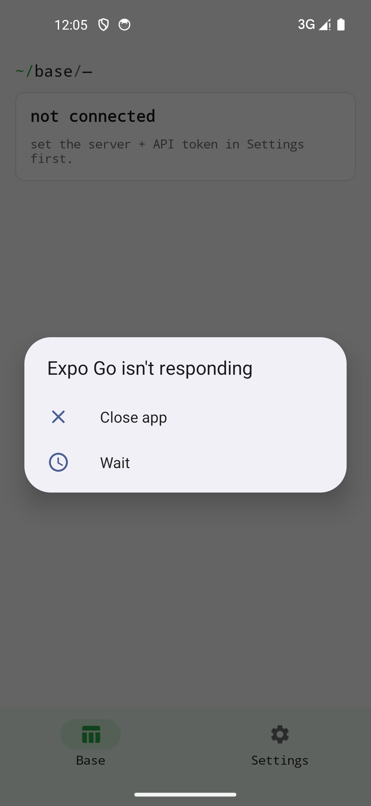

## Voraussetzungen

- Eine eigene, erreichbare SeaTable-Instanz (HTTPS empfohlen).
- Ein API-Token (eines Workspaces oder einer einzelnen Base — siehe unten).

## API-Token in SeaTable erzeugen

SeaTable kennt zwei API-Token-Ebenen — beide funktionieren mit der App:

| Ebene | Wo erzeugen | Geltungsbereich |
|-------|-------------|-----------------|
| **Workspace-API-Token** | Workspace → Einstellungen → API-Token | Zugriff auf alle Bases im Workspace |
| **Base-API-Token** | Base öffnen → ⋯-Menü → API-Token | Zugriff nur auf diese eine Base |

Bei beiden gilt: Token kopieren, in der App eintragen.

## App einrichten

1. App aus dem Store installieren und öffnen.
2. Im Einrichtungs-Dialog eintragen:
   - **Server-URL** (z.B. `https://seatable.example.org`)
   - **API-Token** aus dem Schritt oben
3. Die App tauscht das API-Token gegen ein kurzlebiges Base-Token aus und lädt die Liste der erreichbaren Bases.

{width=320}

## Hinweise

- Das Base-Token läuft regelmäßig ab; die App holt automatisch ein neues, ohne Eingabe.
- Die App bearbeitet Zeilen direkt über die SeaTable-API; komplexere Schema-Änderungen (neue Spalten, neue Tabellen) bleiben dem Web-UI vorbehalten.
- Anmeldedaten bleiben im sicheren Speicher des Geräts.
