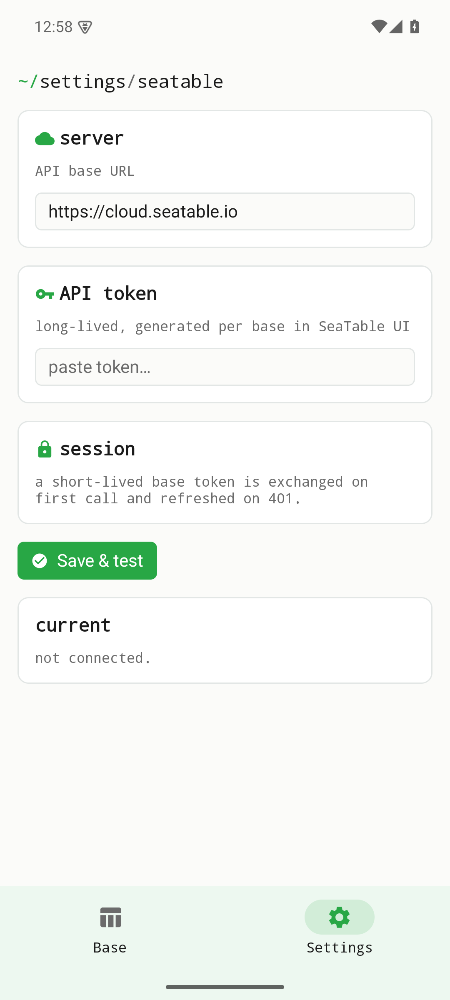

Établi Table est un client natif et léger pour une instance SeaTable auto-hébergée. Il ne dialogue qu'avec le serveur que vous lui indiquez — pas de service central, aucun tiers entre les deux. Les figures ci-dessous sont de vraies captures d'écran de la version 0.1.0 pour Android ; elles montrent les écrans accessibles avant toute connexion à un serveur. Les écrans de données nécessitent une instance SeaTable joignable et ne sont pas simulés ici.

## Non connecté — l'état d'accueil

L'onglet d'accueil utilise le fil d'Ariane de style terminal de la suite et indique clairement qu'aucun serveur SeaTable n'est configuré. Il vous renvoie vers les Réglages — c'est là qu'on définit d'abord le serveur et les identifiants. Rien n'est récupéré tant que vous n'êtes pas connecté.

{width=320}

## Réglages — serveur et identifiants

Les Réglages sont l'endroit où vous saisissez l'URL de votre instance SeaTable et vos identifiants. Les identifiants résident dans le coffre-fort sécurisé de la plateforme (Android EncryptedSharedPreferences). Une fois connectée, l'application dialogue directement avec votre serveur — et avec lui seul.

{width=320}

## Écrans dépendant du backend

Les écrans de données — parcourir les bases, ouvrir des tables, consulter des lignes et modifier des champs individuels — nécessitent une **instance SeaTable joignable et des identifiants valides**. Ces écrans ne sont **volontairement pas simulés** ici : ils deviennent accessibles dès que vous connectez un serveur dans les Réglages. Une future capture sur une instance SeaTable de test viendra compléter cette page avec les vues de données en direct.

## Où l'obtenir

Établi Table est **en cours de développement actif** et, pour l'instant, uniquement disponible sur Android. Installez l'APK de développement signé depuis la version 0.1.0 :

- **Android (APK signé)** — [GitHub Releases · v0.1.0](https://github.com/etabli-dev/etabli-table/releases/tag/v0.1.0)
- App Store (iOS), Google Play et F-Droid — prévus, pas encore disponibles.
