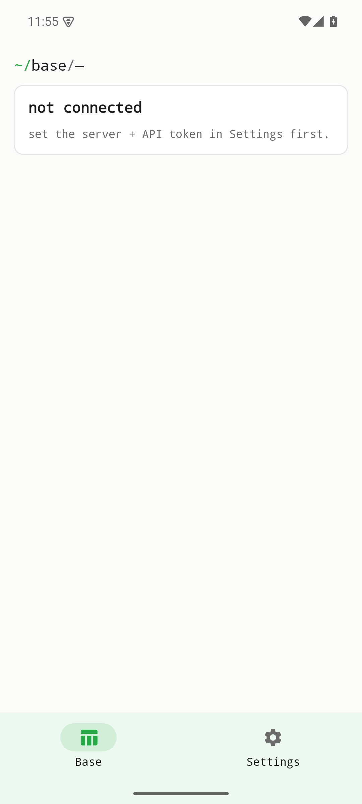

# table — Vignette & Tutorial (v0.1.0)

> **Établi table** is a lean, native client for a **self-hosted
> SeaTable** instance. It talks only to the server you point it at — there is no
> central service and no third party in between. Credentials live in the platform
> secure store (Android EncryptedSharedPreferences).
>
> **Stack:** native Android (Kotlin + Jetpack Compose) and iOS (SwiftUI). Part of
> the **établi** suite (Coder design system). Figures are real screenshots of the
> v0.1.0 build on an Android emulator, regenerated by `scripts/capture.sh`.

## Table of contents
1. [Quick start](#quick-start)
2. [Not connected — the starting state](#feature-not-connected)
3. [Settings — server & credentials](#feature-settings)
4. [Reproducing these figures](#reproducing-these-figures)
5. [Backend-dependent screens](#backend-dependent-screens)
6. [Version](#version)

## Quick start
Install `table-0.1.0.apk` and open it. With no server configured yet,
the app shows a **not connected** state and points you to Settings.



## Feature: Not connected
The home tab uses the suite's terminal-style breadcrumb and clearly states that no
SeaTable server is configured — "set the server + credentials in Settings first".
Nothing is fetched until you connect.


## Feature: Settings
**Settings** is where you enter your SeaTable instance URL and credentials. Once
connected, the app talks directly to your server.


## Reproducing these figures
```bash
( cd android && ./gradlew :app:assembleDebug )
adb install -r android/app/build/outputs/apk/debug/app-debug.apk
bash scripts/capture.sh
```
Device: 1080×2400 @ 420dpi, animations disabled.

## Backend-dependent screens
The data screens (browsing, viewing and managing your SeaTable content) require a
**reachable SeaTable instance and valid credentials**, which this capture run did
not have. Those screens are intentionally **not faked** here — they are reachable
once you connect a server in Settings. A future capture against a test SeaTable
instance will extend this vignette with the live data views.

## Version
Documents établi **table v0.1.0** (applicationId `com.raban.etabli.table`). Part of the
établi (workbench) suite.
